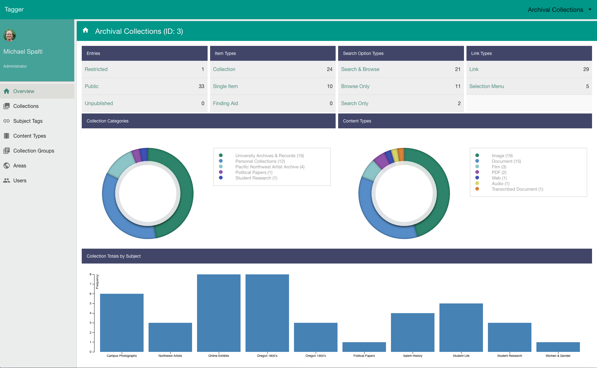
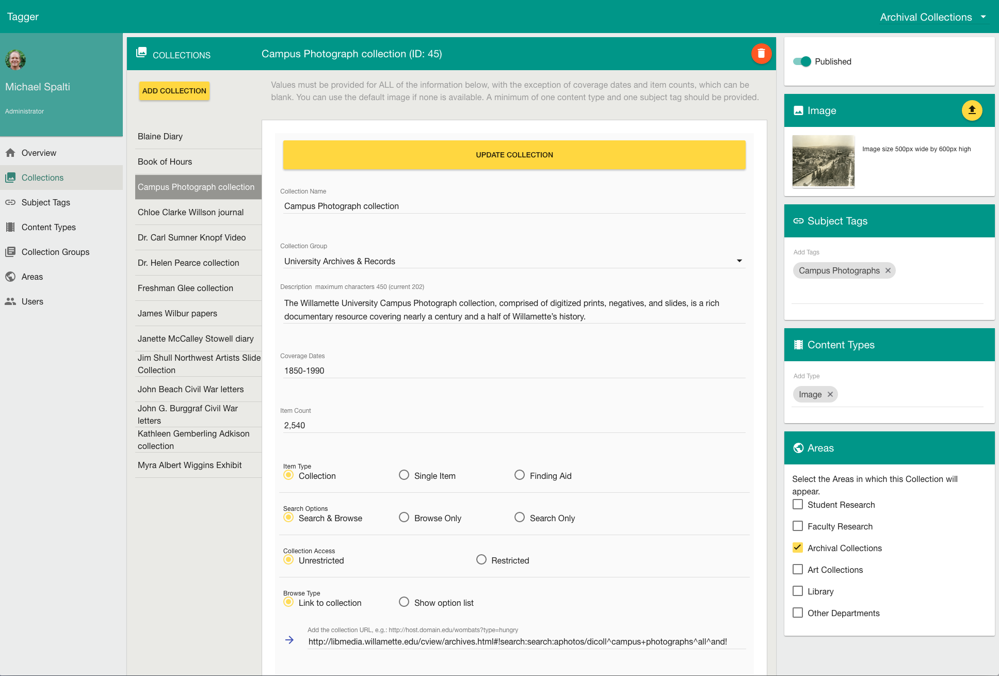

#  Tagger
 
[](https://travis-ci.org/mspalti/test-app)
[](https://coveralls.io/r/mspalti/test-app/?branch=master)

 
Tagger is backend service for publishing digital collections, exhibits and other online resources.  It offers a way to describe and organize these 
resources by content type and by subject tags.  Areas and collection groups provide an additional layer of organization that can be 
used to link back to the departments and parent organizations that produce and own the digital content.
 
Tagger is an Angular, Express, NodeJs application that persists collection information in a Mysql/MariaDb database.  It provides a public REST API for creating clients that use
information about the collections managed in Tagger.
 
## Area Overview
 

 
## Collections Page
 

 
### Setup
 
To get started with development, clone the project into your working directory.
 
 
Next, install the dependencies:
 
     npm install
 
     bower install
     
## Mysql/MariaDb
 
The application requires mysql or MariaDb.  For development, you need to install mysql on your machine and create databases 
(Note that acomtags is the production database; you don't it for local development work.):
 
     acomtags_development
     acomtags_test
     acomtags
 
Assign access permissions to the empty databases. 
 
Access the database by setting the user name and password the the project configuration described below. 
 
## Configuration
 
Configuration for development, production, and test run environments is provided by `server/config/environmentjs`.  This file relies in turn
on `server/credentials/credentials.js`. Two configuration files are needed to separate sensitive credentials from shared code.  This means 
you will need to create your own `server/credentials/credentials.js` file.  A sample is provided.
 
### Environment
 
The `/server/config/environment.js` file provides values for the current environment (development, production or test). Many of the actual
values are defined in the credentials file.  Important values defined directly inside `enviroment.js` are:
 
 * The server port.
 * The mysql host and port.
 * The server dialect (mysql or mariadb)
 * Paths to executables (e.g. convert and identify) and working directories (e.g. the image directory)
 * Whether to require OAUTH2 authentication 
 * Whether to force sync the database on startup (this will true for testing only!)
 
   
 Here's an example development configuration:
 
 ```javascript
  development: {
    app: {
      name: 'tagger'
    },
    uid: credentials.develuid,
    gid: credentials.develgid,
    port: 3333,
    mysql: {
      db: 'acomtags_development',
      user: credentials.develdbuser,
      password: credentials.develdbpassword,
      host: 'localhost',
      port: 3306,
      dialect: 'mysql'
    },
    sync: {force: false},
    useAuth: false,
    convert: '/usr/local/bin/convert',
    identify: '/usr/local/bin/identify',
    taggerImageDir: '/usr/local/taggerImages',
    googleClientId: credentials.googleClientId,
    googleClientSecret: credentials.googleClientSecret,
    googleCallback: credentials.googleCallback,
    externalHostA: credentials.externalHostA,
    externalHostB: '', // not in use
    nodeEnv: env
  }
     
   ```
 
The application uses Sequelize for the ORM.  Tagger database tables are generated by when the application is first started and updated as 
needed.  Note that if you set the sync parameter to be `{force: true}` then the database will be recreated entirely each time you start
the program.  This can be useful when testing with a tool like [supertest](https://github.com/visionmedia/supertest). 
 
### Credentials
 
 You will need to provide a `config/credentials.js` file.  Sample:
 
 ```javascript
 ''use strict';
  
  var credentials = { 
    develuid: <your system uid>,
    develgid: <your system gid>,
    develdbuser: <development database user name>,
    develdbpassword: <development database password>,
    googleClientId: <google oauth client id>,
    googleClientSecret: <google oauth client secret>,
    googleCallback: <path to google oauth callback>,
    uid: <node uid>,
    gid: <node gid>,
    user: <production database user>,
    password: <production database password>,
    productiondbhost: <production database host> 
  };
 
 module.exports = credentials;
 
 ```
  
### User Permission
 
Tagger uses Google OAUTH2 for authentication.  Authorized users are  identified by their Google profile email id (e.g. userh@wu.edu).  
 
Currently, we are not creating a default administrator account.  Before logging into Tagger for the first time, you first must add 
yourself to the database Users table.  Insert values for name, email, area (0 is administrator), createdAt and updatedAt.
 
### Development
 
To start the development server, type:
  
  `npm run dev`
 
When you first start the application in development mode, Sequelize will create tables in the `acomtags_development` database.
 
The Express server will run on the development port configured in `config/environment.js` (e.g. 3000).  A browser window is opened on start and the watch service should restart the Express server and compiles sass whenever files are updated.  
 
The Tagger application uses Jade templates. 
 
The grunt `watch` task doesn't update the browser window automatically with file edits.  This might be possible, but
my attempt to use livereload with the Jade templates ran into a problem with conditional logic in the templates (much of that is now removed).  So, when coding you'll need to manually refresh the browser.
 
 
### Production
 
The procedure for deploying the application is basic and a bit cumbersome.  We are on the lookout for a better strategy.
 
First, the prerequisites: make sure nodejs is installed on the server. It's wise to use the identical nodejs version that you are using in your development environment.
 
You need to decide how to manage the application runtime on your server. Currently, we use the `forever` CLI to launch and keep the Express application online. Install `forever` globally as follows:
 
     sudo npm install forever -g
     
Create an init.d script that launches the application using `forever` as well as a second init.d script that starts the `redis` session store. Add these two startup tasks to your system runlevels. 
 
Create a `node` user on the system. Next, verify that your init.d startup script sets the `NODE_ENV` value to 'production.' Example: `NODE_ENV=production $DAEMON $DAEMONOPTS start $NODEAPP`. 
 
The following deployment assumes that you have previously built and tested the application on your development machine. 
 
    1. Copy the project to the production host. If you know what you are doing, you can omit unnecessary development files.
    2. Update the details of the NodeJs production environment in `config/credentials.js` and `config/environment.js`, including database access credentials, paths, and Google OAUTH2 credentials.
    3. Update the AngularJs `public/javascripts/app/environment.js` object with the production host REST path.
    4. If you are updating an existing installation, stop `forever` via the init script (e.g.  /sbin/service acomtagger start).
    5. Copy the application directory to the production directory.
    6. Set the owner and group for project all files (including .* files) to the `node` user.  
    7. Start `forever` via the init.d script (e.g. /sbin/service acomtagger start). 
 
### Oauth2 Authentication Configuration
 
 Access to the Tagger module is controlled by Google OAuth2.  After a successful OAuth2 login, the `Users` table of the Tagger database is queried by the email address returned in the OAuth2 user profile.  To access Tagger, the email address 
  must be in the database.  You will need to add this manually.
 
### Configuration Params
 
 Configuration file: config/environment.js
 
 - root: path set by module
 - port: Express port
 - uid: Express system user
 - gid: Express system group
 - redisPort: port used by the redis session store (production environment only)
 - mysql.db: database name
 - mysql.user: database user
 - mysql.password: database password
 - mysql.host: host name (e.g. libdb.willamette.edu)
 - mysql.dialect: the client type (mysql or mariadb)
 - convert: location of ImageMagick convert library
 - identify: location of ImageMagick identify library
 - taggerImageDir: path to tagger images
 - adminPath: path to jade files
 - googleClientId: the Google ID for this application (used by OAUTH2)
 - googleClientSecrect: Google secret (used by OAUTH2)
 - nodeEnv: current node environment (startup setting or default)
 
