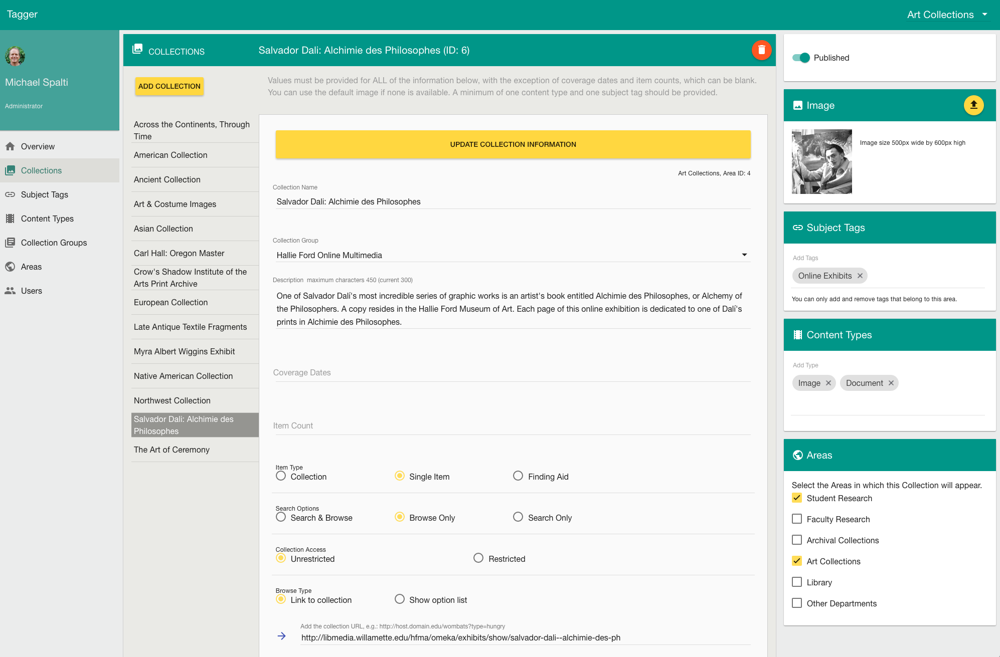

#  Tagger
 

Tagger implements a specific approach to publishing information about the digital artifacts produced by a community or organization.

In this approach, information about a digial item or collection is added to a Collection object.  The Collection object is immediately assigned to a general Area that can be topical or administrative (e.g. student research or University Archives). Areas in turn can have one or more Collection Groups that are specific homes for Collections.

All Collections in Tagger must be associated with one or more Areas and (optionally) with a single Collection Group. This provides structure, context and the ability to discover more about the people and departments who produce and own the content. Subject tags and content types can also be assigned to support browsing and discovery.

The Collections Page image below illustrates some of these relationships.

Every entity in Tagger has descriptive fields that are populated using the Tagger administrative interface. Beyond titles and descriptions, these fields include URLs, link types, link labels, and restrictions.

Access to Tagger's administrative interface is limited to Administrators and Area Maintainers.

## Microservice

Tagger itself is not a fullstack, out-of-the-box publishing solution.  It is a modest microservice that shares information with external clients or other services over the network. External clients can access information such as:

 * All Collections 
 * The Collections in an Area
 * The Collections in a Collection Group
 * Collections by Subject Tag
 
See documentation for the [Public API](https://github.com/hatfieldlibrary/tagger-2/wiki/Public-API).

Tagger persists information in a Mysql/MariaDb database. Tagger is written using [NodeJs](https://nodejs.org/en/), [Express](http://expressjs.com), [Sequelize](http://docs.sequelizejs.com/en/v3/), [AngularJs (1.6+)](https://angularjs.org/) and [Angular Material]( https://material.angularjs.org/latest/).
 The AngularJs administrative client is [Component-based](https://docs.angularjs.org/guide/component).
 
 
## Area Overview
 

 
## Collections Page
Administrative view.
 

 
 
## Getting started
 
To get started with development, clone the project into your working directory.
 
 
Next install project dependencies using [npm](https://www.npmjs.com/) and [bower](https://bower.io/).  

     npm install
 
     bower install
     
Node, npm and bower need to be installed if you do not have them already.
  
## Mysql/MariaDb
 
The application requires mysql or MariaDb.  For development, you need to install mysql on your machine and create databases. The database names are set in configuration and can be whatever you like so long as separate databases are created for development, testing and production.
 
     tagger_development
     tagger_test
     tagger
 
Assign access permissions to the empty databases using the development credentials described below. 

(Note: In this example tagger is the production database. You obviously don't need the production database for local development work. You will want development and test databases)

Database tables for the Tagger database schema are generated when the application is first started.
 

## Configuration
 
Configurations for development, production, and test environments are defined in `server/config/environment.js`.  This configuration file relies in turn
on `credentials.js` for sensitive information such as OAUTH2 keys. You will need to create your own `credentials.js` file. A sample file is provided in `server/credentials`.  

Be sure to place the credential file outside of the project itself.  The path to the `credentials.js` file on your local development system is defined in `server/config/require-paths.js` and assumes your home directory: `~/etc/tagger/configuration.js`.

See the documentation for [more about Tagger configuration](https://github.com/hatfieldlibrary/tagger-2/wiki/Configuration).  
  
  
## User Authentication
 
Tagger uses Google OAUTH2 for authentication.   
 
Currently, we are not creating a default administrator account.  Before logging into Tagger for the first time, you first must add yourself to the database Users table.  Insert values for name, email, area (0 is administrator), createdAt and updatedAt.
 
 
## Local Development
 
To start the development server, type:
  
  `npm run dev`
 
The first time you start the application in development mode, Sequelize will create tables in the `tagger_development` database.
 
The Express server will run on the development port configured in `config/environment.js` (e.g. 3000). This project uses [browser-sync](https://www.browsersync.io/) for synchronized browser testing, including automatic page 
refresh on code changes. You can bypass browser-sync and run the server directly if you prefer.
 
## Unit Tests
 
Jasmine unit tests are included for the administrative client code.  Mocha/Chai/Sinon unit tests are included for the API controllers.
 
## Integration Tests

Mocha integration tests run against the test database.  To execute tests with full reporting, use this `gulp` task:

  `gulp server.integration_test`
  
For quicker tests with minimal reporting, use this npm script:

   `npm run test-server`
 
 
## Production Build and Deploy
 
To build the optimized version of client code, use this command:

`npm run build-dist`

This executes `gulp` build tasks and copies the new code into the `dist` directory.

It's a good idea to remove development dependencies.  A convenient way to do this is with the [Strongloop command line tool](https://docs.strongloop.com/display/SLC/Building+applications+with+slc).  You can install this via `npm install -g strongloop`. Then build the zipped tar file using the `slc` command line tool: `slc build --install --pack`. 

After packaging the application using the command line tool, copy the zip file to the server.
 
