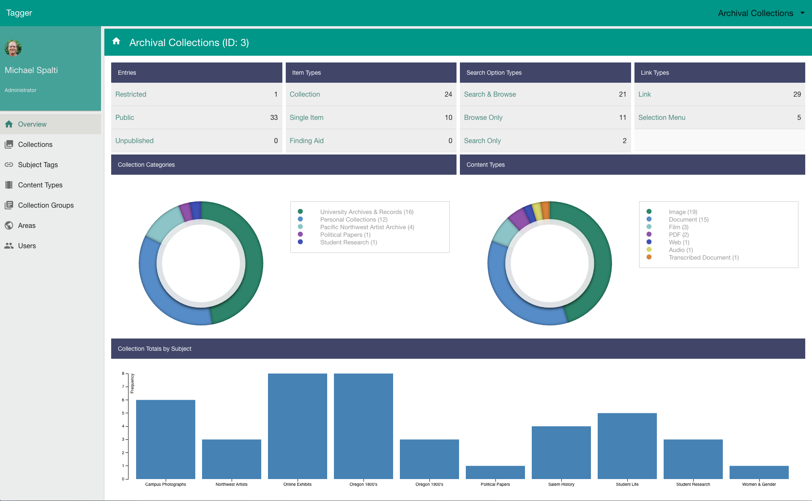
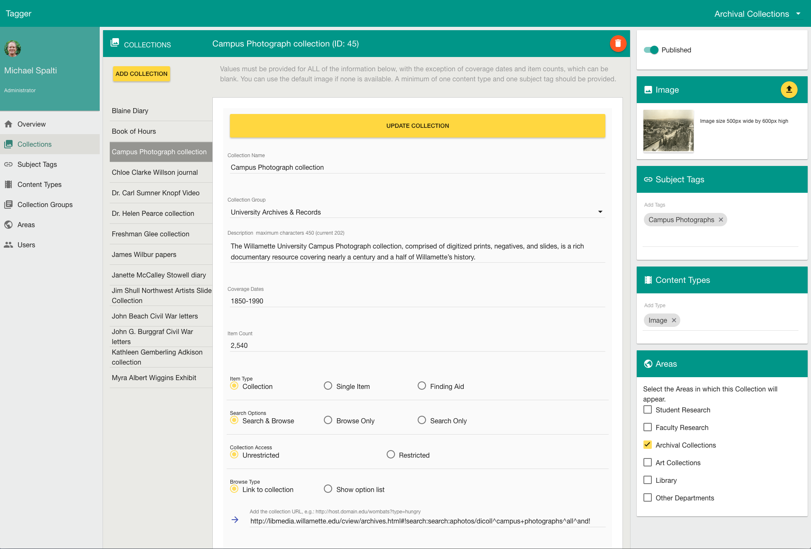

#  Tagger
 
[](https://travis-ci.org/mspalti/test-app)
[](https://coveralls.io/r/mspalti/test-app/?branch=master)
[](https://www.bithound.io/github/hatfieldlibrary/tagger-2/master/dependencies/npm)
[](https://www.bithound.io/github/hatfieldlibrary/tagger-2)
[](https://www.bithound.io/github/hatfieldlibrary/tagger-2)

 
Tagger is backend service for publishing digital collections, exhibits and other online resources.  It offers a way to describe and organize these 
resources by content type and by subject tags.  Areas and collection groups provide an additional layer of organization that can be 
used to highlight the departments and parent organizations that produce and own the digital content.
 
Tagger is an Angular, Express, NodeJs application that persists collection information in a Mysql/MariaDb database.  It provides a public REST API for creating clients that use
information about the collections managed in Tagger.
 
 
## Area Overview
 

 
## Collections Page
 

 
 
## Getting started
 
To get started with development, clone the project into your working directory.
 
 
Next install project dependencies using [npm](https://www.npmjs.com/) and [bower](https://bower.io/).  Node, npm and bower need to be installed
if you do not have them already.
 
     npm install
 
     bower install
     

## Mysql/MariaDb
 
The application requires mysql or MariaDb.  For development, you need to install mysql on your machine and create databases. The database names 
are set in configuration and can be whatever you like so long as separate databases are created for development, testing and production.
(Note that in this example acomtags is the production database; you don't it for local development work.)
 
     acomtags_development
     acomtags_test
     acomtags
 
Assign access permissions to the empty databases using the development credentials described below. 

The application uses [Sequelize](http://docs.sequelizejs.com/en/v3/).  Tagger database tables are generated by when the application is first started and updated as 
needed.  Note that if you set the sync parameter to be `{force: true}` then the database will be recreated entirely each time you start
the program.  This can be useful for testing. 
 

## Configuration
 
Configuration for development, production, and test environments is provided by `server/config/environmentjs`.  This file relies in turn
on `server/credentials/credentials.js`. 

Two configuration files are required to separate sensitive credentials from shared code.  This means 
you need to create your own `server/credentials/credentials.js` file.  A sample file is provided.
 

### Environment
 
The `/server/config/environment.js` file provides values for the current environment (development, production or test). Many of the actual
values are defined in the credentials file.  Important values defined directly inside `enviroment.js` are:
 
 * The server port.
 * The mysql host and port.
 * The server dialect (mysql or mariadb)
 * Paths to executables (e.g. convert and identify) and working directories (e.g. the image directory)
 * Whether to require OAUTH2 authentication 
 * Whether to force sync the database on startup (this will true for testing only!)
 
   
Here's an example development configuration:

```javascript
  development: {
    app: {
      name: 'tagger'
    },
    uid: credentials.develuid,
    gid: credentials.develgid,
    port: 3333,
    mysql: {
      db: 'acomtags_development',
      user: credentials.develdbuser,
      password: credentials.develdbpassword,
      host: 'localhost',
      port: 3306,
      dialect: 'mysql'
    },
    sync: {force: false},
    useAuth: false,
    convert: '/usr/local/bin/convert',
    identify: '/usr/local/bin/identify',
    taggerImageDir: '/usr/local/taggerImages',
    googleClientId: credentials.googleClientId,
    googleClientSecret: credentials.googleClientSecret,
    googleCallback: credentials.googleCallback,
    externalHostA: credentials.externalHostA,
    externalHostB: '', // not in use
    nodeEnv: env
  }  
```
 
### Credentials
 
You will need to provide a `config/credentials.js` file.  Sample:
 
```javascript
 'use strict';
  
  var credentials = { 
    develuid: <your system uid>,
    develgid: <your system gid>,
    develdbuser: <development database user name>,
    develdbpassword: <development database password>,
    googleClientId: <google oauth client id>,
    googleClientSecret: <google oauth client secret>,
    googleCallback: <path to google oauth callback>,
    uid: <node uid>,
    gid: <node gid>,
    user: <production database user>,
    password: <production database password>,
    productiondbhost: <production database host>,
    externalHostA: {  // This is optional path to external host.
        host: <external host name>,
        port: <external host port>,
        path: <external host api query path>
      }
  };
 
 module.exports = credentials;
```
  
  
## User Authentication
 
Tagger uses Google OAUTH2 for authentication.  Authorized users are identified by their Google profile email id.  
 
Currently, we are not creating a default administrator account.  Before logging into Tagger for the first time, you first must add 
yourself to the database Users table.  Insert values for name, email, area (0 is administrator), createdAt and updatedAt.
 
 
## Development Server
 
To start the development server, type:
  
  `npm run dev`
 
The first time you start the application in development mode, Sequelize will create tables in the `acomtags_development` database.
 
The Express server will run on the development port configured in `config/environment.js` (e.g. 3333). This project uses [browser-sync](https://www.browsersync.io/) for synchronized browser testing, including automatic page 
refresh on code changes.
 
 
## Integration Tests

Mocha integration tests run against the test database.  To execute tests with full reporting, use this `gulp` task:

  `gulp server.integration_test`
  
For quicker tests with minimal reporting, use this npm script:

   `npm run test-server`
 
 
## Production Build
 
To build the optimized version of client code, use this command:

`npm run build-dist`

This executes all `gulp` build tasks and copies the new code into the `dist` directory.

It's a good idea to remove development dependencies.  A convenient way to do this is with the [Strongloop command line tool](https://docs.strongloop.com/display/SLC/Building+applications+with+slc).  You can install this via `npm install -g strongloop`.
Then build the zipped tar file using the `slc` command line tool: `slc build --install --pack`.  
 

